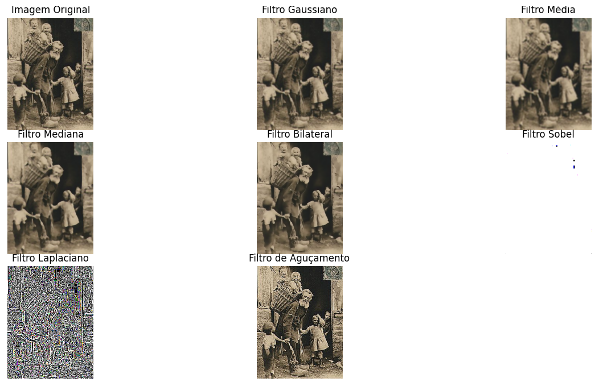
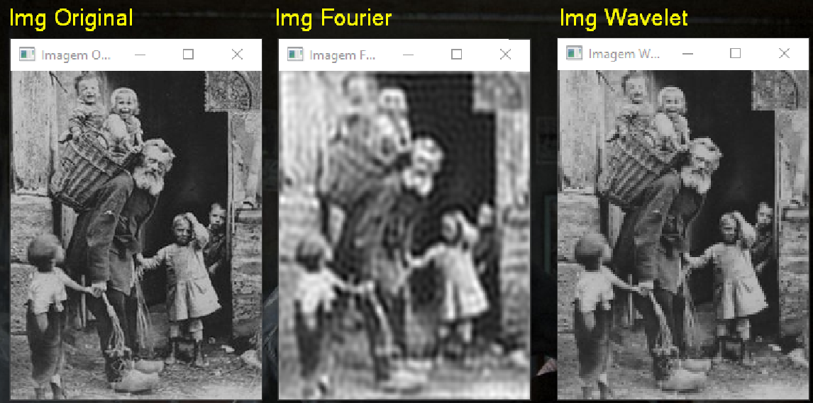

# README - Filtros para Aprimoramento de Imagem

## Parte 1: Filtro de Aguçamento

Entre os filtros aplicados, o **filtro de aguçamento** (ou *sharpening*) foi o mais eficaz para aprimorar a imagem. Esse filtro é projetado para realçar os detalhes da imagem, aumentando o contraste entre os pixels adjacentes e acentuando as bordas. Através desse processo, a nitidez da imagem é melhorada, tornando os contornos mais definidos e visíveis. O filtro de aguçamento demonstrou ser particularmente útil em imagens que carecem de clareza e precisão nas bordas.

### Como Funciona o Filtro de Aguçamento:
- Aumenta a diferença entre os pixels de uma região da imagem, destacando as transições entre áreas claras e escuras.
- Utiliza um kernel específico que ajusta os valores dos pixels para realçar detalhes finos e texturas.

Após aplicar o filtro de aguçamento, observou-se que a imagem ficou mais detalhada, com bordas mais nítidas, o que fez dela a melhor opção entre os filtros testados para este tipo de aprimoramento.

## Parte 2: Transformada de Wavelet

Por outro lado, a **transformada de wavelet** foi a técnica mais eficaz para aprimorar a imagem em termos de compressão e remoção de ruído. A transformada de wavelet permite decompor a imagem em diferentes níveis de resolução, preservando as características importantes da imagem enquanto elimina componentes indesejados, como ruído. Esse processo de multi-resolução proporciona um aprimoramento significativo, mantendo a integridade das informações visuais enquanto melhora a qualidade da imagem.

### Como Funciona a Transformada de Wavelet:
- Divide a imagem em diferentes escalas de resolução, focando nas frequências de alta e baixa.
- Realiza uma análise detalhada em diferentes níveis para separar características importantes do ruído.

A transformada de wavelet se mostrou particularmente eficiente para melhorar imagens com ruídos excessivos ou imagens que necessitavam de uma análise em múltiplos níveis de detalhe.

---